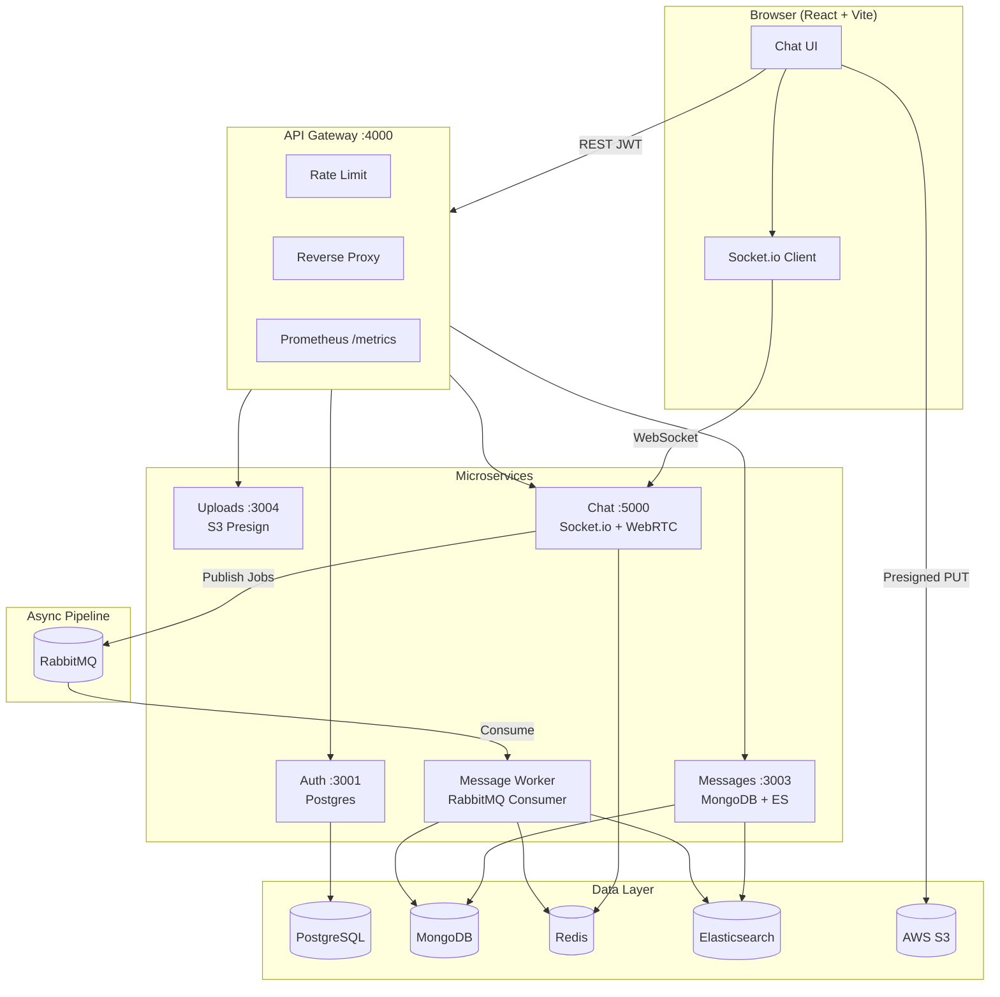

# WebChat
A production-oriented, horizontally scalable real-time chat platform built with a Node.js microservices architecture.

[](https://github.com/theritikkk/WebChat/actions/workflows/ci.yml)
[](LICENSE)

---

## Architecture Overview



### Request paths

| Path | Flow |
|------|------|
| Auth | Client → Gateway → Auth → Postgres |
| Messages | Client → Gateway → Messages → Mongo (+ Redis room cache) |
| Search | Client → Gateway → Messages → Elasticsearch (Mongo fallback) |
| Real-time | Client ↔ Chat (Socket.io) → Redis adapter for multi-pod |
| Persist | Chat → RabbitMQ → Worker → Mongo + ES → Redis pub/sub → Chat confirms ID |
| Uploads | Client → Gateway → Uploads presign → Client PUT → S3 |
| Presence | Client → Gateway → Chat → Redis |
| WebRTC | Client ↔ Chat signaling → P2P media |

See [docs/ENGINEERING_AUDIT.md](docs/ENGINEERING_AUDIT.md) for the full architecture audit, dependency graph, and remediation roadmap.

---

## Services

| Service | Port | Description |
|---------|------|-------------|
| gateway | 4000 | Reverse proxy, rate limiting, CORS |
| auth | 3001 | JWT auth, user management, rooms (Postgres) |
| messages | 3003 | Message history, read receipts, ES search (Mongo) |
| chat | 5000 | Socket.io real-time engine, WebRTC signaling |
| uploads | 3004 | AWS S3 presigned URL generation for file uploads |
| message-worker | — | RabbitMQ consumer → MongoDB + Elasticsearch |

---

## Key Features

| Feature | Implementation |
|---------|---------------|
| Real-time messaging | Socket.io with Redis adapter (multi-instance) |
| Async message pipeline | RabbitMQ → Message Worker → MongoDB + ES → Redis pub/sub → Chat confirms |
| Optimistic delivery | Temp IDs broadcast instantly; swapped for real Mongo `_id` on confirmation |
| Distributed presence | Redis-backed cross-instance user online/offline (300s TTL + 60s heartbeat) |
| File uploads | S3 presigned PUT URLs — binary never hits app servers |
| Full-text search | Elasticsearch with MongoDB regex fallback |
| WebRTC calls | Peer-to-peer video/audio via Socket.io signaling (Google STUN) |
| Read receipts | IntersectionObserver → `mark_read` → per-user delivery tracking in MongoDB |
| Auth | JWT access (15 min) + refresh (7 day) tokens, bcrypt (12 rounds) |
| Metrics | Prometheus + Grafana dashboards (gateway, chat, messages); `/metrics` restricted to internal IPs |
| Horizontal scale | Chat replicas, Worker replicas, Redis adapter, K8s HPA |
| **Security** | Logout + token revocation, SQL migrations, presence auth, XSS sanitization, JWT startup guard, OTEL tracing |

---

## Quick Start (Local Dev)

### Prerequisites

- Node.js 20+
- Docker + Docker Compose

### 1 — Clone and configure

```bash
git clone https://github.com/theritikkk/WebChat.git
cd WebChat
cp .env.example .env
# IMPORTANT: Edit .env and set a strong JWT_SECRET before running in production
#     Run: openssl rand -hex 64
#     Services will refuse to start with NODE_ENV=production + default secret
```

### 2 — Start infrastructure

```bash
docker compose up -d postgres mongo redis rabbitmq elasticsearch
# RabbitMQ is required for the async message pipeline
```

### 3 — Install dependencies

```bash
npm install
```

### 4 — Run services

```bash
PORT_AUTH=3001 node services/auth/src/index.js
PORT_MESSAGES=3003 node services/messages/src/index.js
node services/message-worker/src/index.js
PORT_CHAT=5000 node services/chat/src/index.js
PORT_UPLOADS=3004 node services/uploads/src/index.js
PORT_GATEWAY=4000 node services/gateway/src/index.js
cd apps/client && npm run dev
```

Or use VS Code: Run > Run All Tasks (`.vscode/tasks.json`).

### 5 — Full stack via Docker Compose

```bash
docker compose --profile app up -d
```

---

## Message Queue Flow

```
send_message (Socket.io)
 |
 +-- Optimistic broadcast to room (instant)
 |
 +-- publishMessage() -> RabbitMQ "webchat.messages" exchange
 |
 Message Worker consumes
 |
 MongoDB.create() + ES.index()
 |
 Redis PUBLISH webchat:message:persisted
 |
 Chat service -> message_confirmed -> room (final ID)
```

If RabbitMQ is unavailable, the chat service falls back to synchronous HTTP persistence via the messages service.

---

## File Upload Flow

```
1. Client: POST /api/v1/upload/presign { filename, contentType, roomId }
2. Gateway -> Uploads Service -> generates S3 presigned PUT URL (5 min TTL)
3. Client: PUT <presignedUrl> <binary file> (direct to S3)
4. Client: send_message { roomId, file_url, message_type: "image" }
```

---

## Kubernetes Deployment

```bash
kubectl apply -k deploy/k8s/base/
kubectl get pods -n webchat
```

See [docs/PROJECT_GUIDE.md](docs/PROJECT_GUIDE.md) and [deploy/k8s/base/](deploy/k8s/base/).

---

## Monitoring

```bash
docker compose --profile monitoring up -d
# Grafana: http://localhost:3000 (admin / webchat)
# Prometheus: http://localhost:9090
# RabbitMQ UI: http://localhost:15672
```

See [deploy/monitoring/](deploy/monitoring/).

---

## API Reference

| Method | Path | Description |
|--------|------|-------------|
| POST | `/api/v1/auth/register` | Register new user |
| POST | `/api/v1/auth/login` | Login, returns access + refresh tokens |
| POST | `/api/v1/auth/refresh` | Refresh access token |
| POST | `/api/v1/auth/logout` | Revoke refresh token (server-side invalidation) |
| GET | `/api/v1/rooms` | List user's rooms |
| POST | `/api/v1/rooms` | Create a room |
| POST | `/api/v1/rooms/:id/join` | Join a public room |
| GET | `/api/v1/rooms/:id/messages` | Paginated message history |
| GET | `/api/v1/rooms/:id/messages?q=term` | Full-text search |
| POST | `/api/v1/upload/presign` | Get presigned upload URL |
| GET | `/api/v1/presence/:userId` | Check if user is online (JWT required) |

---

## Testing & Verification

WebChat includes a comprehensive automated integration test suite executing unit, API, and multi-instance WebSocket scaling tests across all core microservices:

```bash
# Start local Redis container (required for multi-instance socket scaling test)
docker compose up -d redis

# Run all test suites locally
npm test
```

### Test Strategy & Topology

| Service | Suite File | Strategy | Key Coverage |
|---------|------------|----------|--------------|
| **Auth** | `services/auth/test/auth.test.js` | `sqlite::memory:` | User registration, login, JWT validation, public rooms, room membership |
| **Messages** | `services/messages/test/messages.test.js` | `mongodb-memory-server` | Message CRUD, HTML XSS sanitization (`sanitize-html`), pagination |
| **Chat (Single)** | `services/chat/test/chat.test.js` | `socket.io-client` | Socket authentication, token rejection, `join_room`, disconnect cleanup |
| **Chat (Multi-Pod)** | `services/chat/test/chat-multi-instance.test.js` | `@socket.io/redis-adapter` + Redis 7 | Spins up 2 independent Socket.io server pods on dynamic ports; verifies cross-instance real-time message delivery over Redis Pub/Sub |

### GitHub Actions CI
The CI workflow ([.github/workflows/ci.yml](.github/workflows/ci.yml)) provisions a real **Redis 7 service container** (`redis:7-alpine`) to gate `test-and-build` on 100% passing tests before client build and Docker image generation.

---

## Documentation

| Document | Purpose |
|----------|---------|
| [docs/ARCHITECTURE.md](docs/ARCHITECTURE.md) | **System design deep dive with Mermaid diagrams & C4 models** |
| [docs/ENGINEERING_AUDIT.md](docs/ENGINEERING_AUDIT.md) | **Full architecture audit, security checklist, and roadmap** |
| [docs/PROJECT_GUIDE.md](docs/PROJECT_GUIDE.md) | **Local testing, AWS deployment, resume bullets, and LinkedIn guide** |

---

## Tech Stack

**Backend**: Node.js, Express, Socket.io, Mongoose, Sequelize 
**Queues**: RabbitMQ (amqplib) 
**Databases**: PostgreSQL, MongoDB, Redis, Elasticsearch 
**Storage**: AWS S3 
**Infra**: Docker Compose, Kubernetes, GitHub Actions CI/CD 
**Observability**: Prometheus, Grafana, OpenTelemetry (OTLP tracing), k6 load testing 
**Security**: JWT + refresh token revocation, sanitize-html, SQL migrations, startup guards
