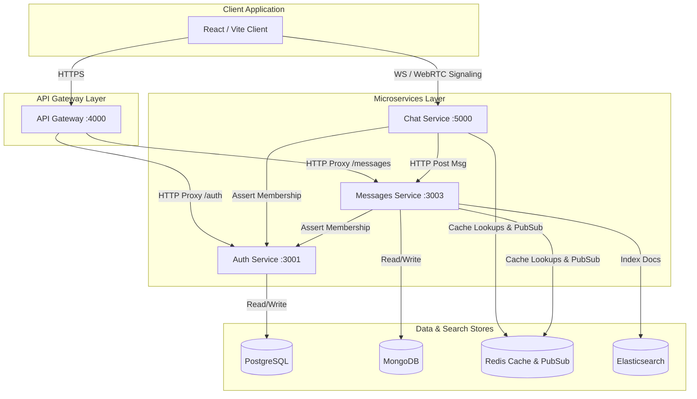
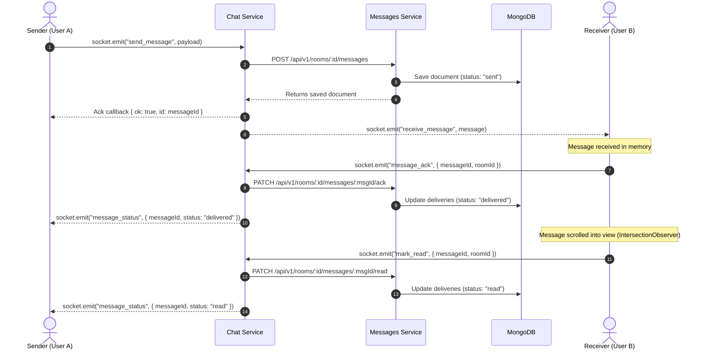
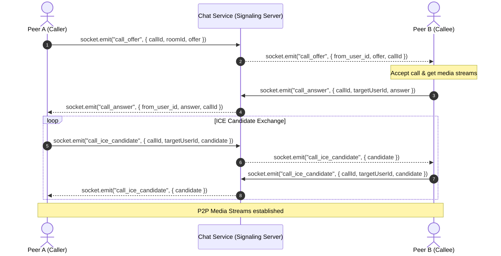
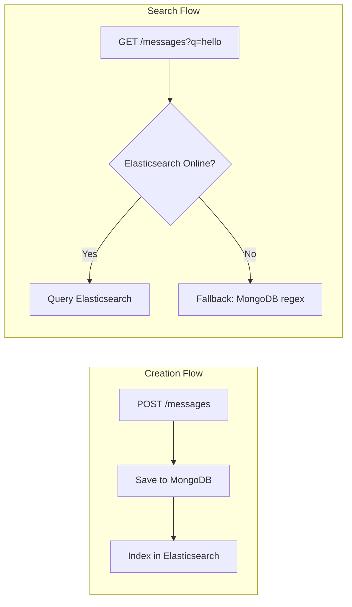

# 🏢 WebChat — Enterprise Architecture Specification

This specification covers the decoupled microservices, database storage layout, live WebSocket mechanisms, caching, search indexing, and monitoring infrastructure.

---

## 📦 Container C4 Diagram

The diagram below details the container layout, entry points, and persistence layers of WebChat:



---

## ✉️ Message Delivery & Read Receipts Flow

WebChat tracks messages from the initial socket transmit through to final display. The flow diagram below details events:



---

## 📹 WebRTC Video Call Signaling Flow

Video calls are established peer-to-peer over the browser RTCPeerConnection API. The Socket.io connection serves as the low-latency signaling channel:



---

## 🔍 Elasticsearch Indexing Flow

Full-text search routes queries to Elasticsearch. If the cluster is unavailable, queries seamlessly fallback to MongoDB regex.



---

## 📊 Prometheus Scrape Topology

The monitoring topology shows how Prometheus collects metrics from gateway, chat, and messages.

```mermaid
graph TD
  Gateway[Gateway Service] -->|Exposes /metrics| GatewayEndpoint[/metrics]
  Chat[Chat Service] -->|Exposes /metrics| ChatEndpoint[/metrics]
  
  Prometheus[(Prometheus Server)] -->|Scrape Job: Gateway| GatewayEndpoint
  Prometheus -->|Scrape Job: Chat| ChatEndpoint
  
  Grafana[Grafana Dashboard] -->|Queries| Prometheus
```
