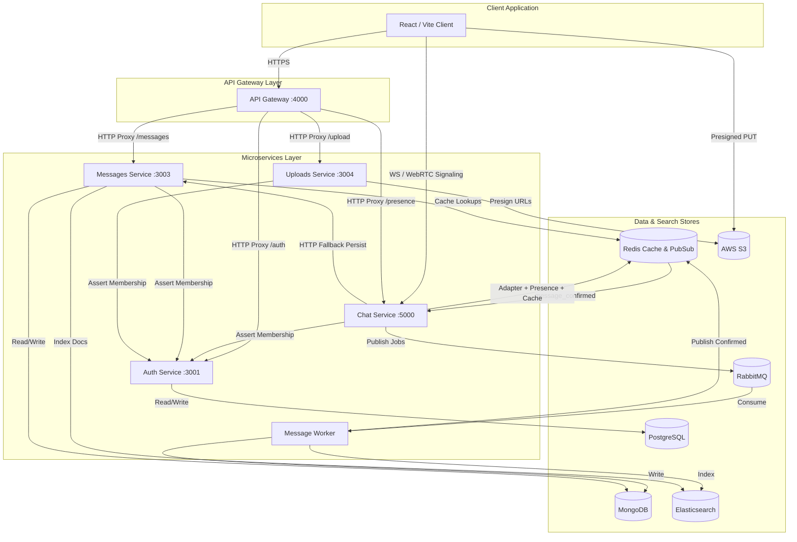
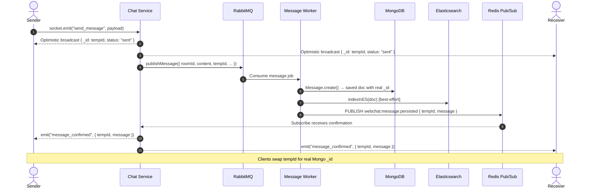
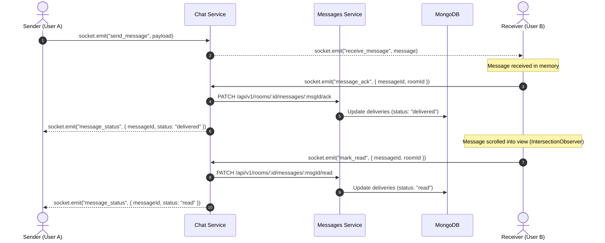
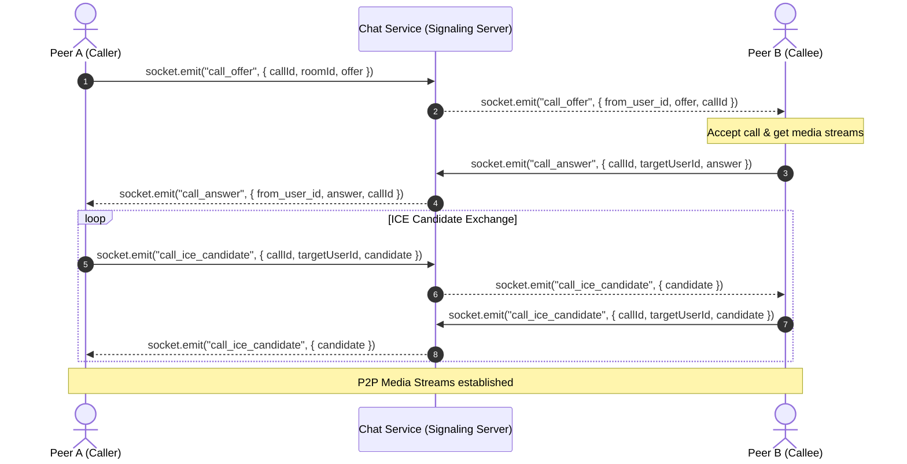
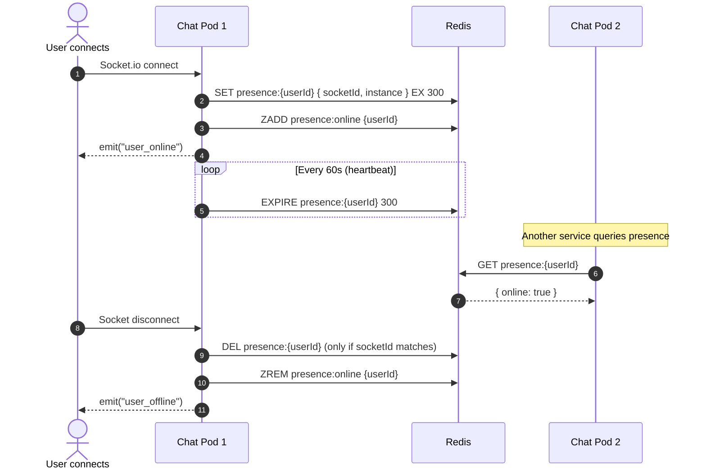
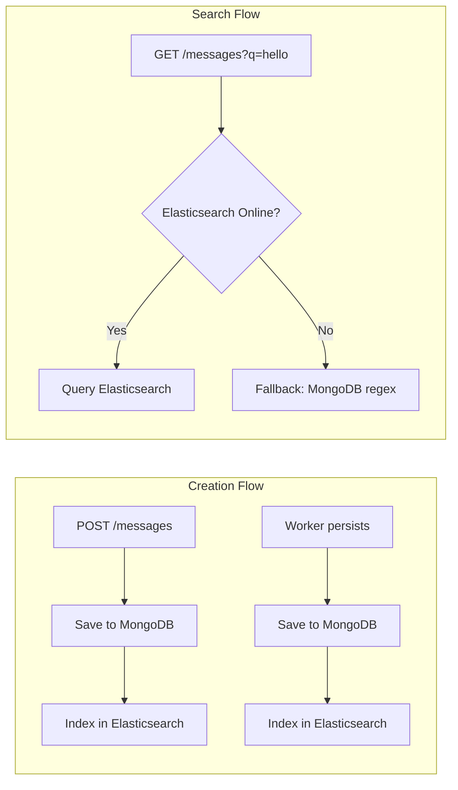
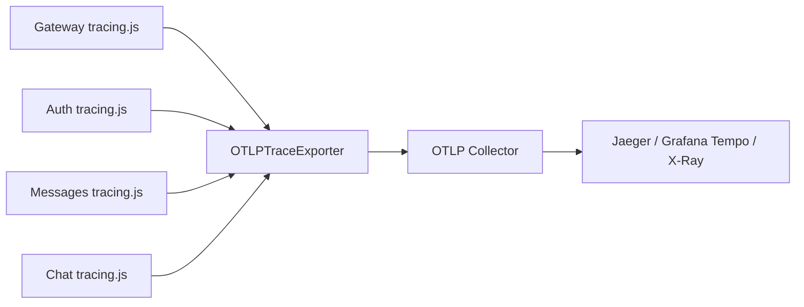
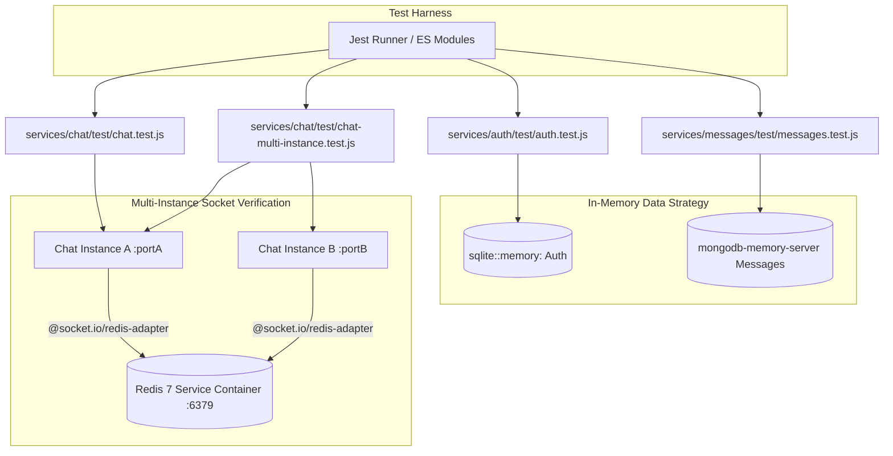

# WebChat — Enterprise Architecture Specification

This specification covers the decoupled microservices, database storage layout, live WebSocket mechanisms, async message queue, caching, search indexing, file uploads, and monitoring infrastructure.

---

## Container C4 Diagram

The diagram below details the container layout, entry points, persistence layers, and the async message pipeline:



---

## Async Message Delivery Pipeline

Messages are persisted asynchronously via RabbitMQ for non-blocking real-time performance:



**Fallback**: If RabbitMQ is unavailable, Chat calls Messages HTTP API synchronously and emits `message_confirmed` directly.

---

## Message Delivery & Read Receipts Flow

WebChat tracks messages from the initial socket transmit through to final display:



---

## WebRTC Video Call Signaling Flow

Video calls are established peer-to-peer over the browser RTCPeerConnection API. The Socket.io connection serves as the low-latency signaling channel:



---

## Distributed Presence (Redis-backed)

Presence is tracked globally across all Chat service instances via Redis:



---

## Elasticsearch Indexing Flow

Full-text search routes queries to Elasticsearch. If the cluster is unavailable, queries seamlessly fallback to MongoDB regex.



---

## Prometheus Scrape Topology

The monitoring topology shows how Prometheus collects metrics from all instrumented services.

```mermaid
graph TD
  Gateway[Gateway Service] -->|Exposes /metrics| GatewayEndpoint[/metrics]
  Chat[Chat Service] -->|Exposes /metrics| ChatEndpoint[/metrics]
  Messages[Messages Service] -->|Exposes /metrics| MessagesEndpoint[/metrics]
  
  Prometheus[(Prometheus Server)] -->|Scrape Job: Gateway| GatewayEndpoint
  Prometheus -->|Scrape Job: Chat| ChatEndpoint
  Prometheus -->|Scrape Job: Messages| MessagesEndpoint
  
  Grafana[Grafana Dashboard] -->|Queries| Prometheus
```

---

## Security Architecture

### Authentication & Session Management

```
Login → { accessToken (15m JWT), refreshToken (7d opaque) }
         │                         │
         │                         └─ Stored as SHA-256 hash in refresh_tokens table (PostgreSQL)
         │                            Raw token never persisted
         └─ Verified per-request (gateway → auth service | direct JWT.verify())

Logout → POST /api/v1/auth/logout { refreshToken }
         │
         └─ refresh_tokens.destroy({ where: { token_hash: sha256(raw) } })
            Token invalidated server-side; cannot be reused even if intercepted
```

### JWT Secret Guard

All 4 JWT-consuming services (`auth/lib/tokens.js`, `chat/lib/auth.js`, `messages/lib/jwt.js`, `uploads/routes/upload.js`) call `process.exit(1)` on startup if `NODE_ENV === "production"` and `JWT_SECRET` equals the default dev value.

### Metrics Access Control

`/metrics` endpoints in gateway, chat, and messages services are protected by `internalOnly` middleware:

```
Request IP → loopback (127.x, ::1) or RFC-1918 (10.x, 172.16-31.x, 192.168.x)?
  YES → next() → serve Prometheus metrics
  NO  → 403 Forbidden
```

### Presence API

`GET /api/v1/presence` and `GET /api/v1/presence/:userId` require a valid Bearer JWT (`requireBearerToken` middleware in Chat service). Unauthenticated requests get `401 Unauthorized`.

### Input Sanitization

Message content is sanitized via `sanitize-html` with a zero-tag allowlist in two places:
1. **Messages service** (`routes/messages.js`) — on HTTP create and edit
2. **Message worker** (`src/index.js`) — on RabbitMQ queue consume

This ensures XSS payloads are neutralized regardless of which persist path is used.

### Database Schema Management

`sequelize.sync({ alter: true })` (unsafe for production) has been replaced with an idempotent migration runner (`services/auth/src/lib/migrate.js`). Migrations are applied in alphabetical order and tracked in a `_migrations` ledger table.

### Distributed Tracing



All 4 HTTP services bootstrap OpenTelemetry as their **first import**, ensuring auto-instrumentation patches Node.js internals before any application code runs.

---

## Automated Testing & Multi-Instance Verification Architecture

WebChat features a non-blocking integration test harness designed for local development speed and high-fidelity CI verification:



### Multi-Instance Redis Adapter Verification

To validate horizontal WebSocket scaling, `chat-multi-instance.test.js` spins up 2 independent Socket.io server instances on dynamic ports (`portA`, `portB`), both attached to `@socket.io/redis-adapter` over Redis.

When Client 1 sends a message to Pod A, Pod A emits over Redis Pub/Sub, and Pod B receives and broadcasts the message to Client 2 on Pod B in real-time. This confirms multi-instance real-time fanout without single-instance bottlenecks.

