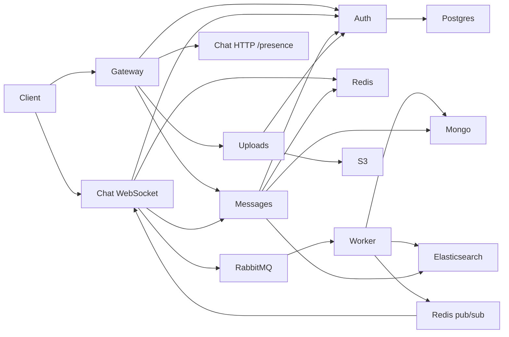

# WebChat Engineering Audit

**Date:** June 2026  
**Scope:** Full-stack distributed chat platform (6 services + worker + React client)  
**Auditor role:** Senior staff engineer / distributed systems review

---

## 1. Executive Summary

WebChat is a well-structured microservices monorepo with real-time messaging, async persistence, search, uploads, WebRTC, and production-oriented infrastructure (Docker, K8s, CI, Prometheus). The architecture is sound for a portfolio/production MVP, but several **cross-service contract gaps**, **K8s networking/config defects**, and **incomplete frontend features** prevent it from being fully enterprise-grade without remediation.

| Area | Grade | Summary |
|------|-------|---------|
| Architecture | B+ | Clear service boundaries; good async persist pattern |
| Real-time | B | Socket.io + Redis adapter; client leave_room fixed |
| Data layer | B | Postgres auth + Mongo messages; ES index unified |
| Security | B | JWT + logout revocation; migrations; metrics/presence secured; XSS sanitized; JWT guard |
| K8s / Ops | C | Network policies and env vars were misaligned (fixed) |
| Frontend | B- | Solid UI; missing virtualization, reactions, edit UI |
| CI/CD | B+ | Automated Jest + Supertest (Auth/Messages), single-instance Socket.io, and multi-instance Redis pub/sub scaling test suite running in CI before build steps |
| Observability | B | Gateway/chat metrics; OpenTelemetry tracing added (4 services) |

---

## 2. System Architecture

### 2.1 Service inventory

| Service | Port | Store | Responsibility |
|---------|------|-------|----------------|
| gateway | 4000 | — | Reverse proxy, rate limit, CORS, metrics |
| auth | 3001 | PostgreSQL | Users, JWT, rooms, membership |
| messages | 3003 | MongoDB + ES | History, search, ack/read HTTP API |
| chat | 5000 | Redis, RabbitMQ | Socket.io, presence, WebRTC, queue publish |
| uploads | 3004 | S3 | Presigned PUT/GET |
| message-worker | — | Mongo, ES, Redis | RabbitMQ consumer, persist, confirm pub |

### 2.2 Dependency graph

### 2.3 Service communication map

| From | To | Protocol | Purpose |
|------|-----|----------|---------|
| Browser | gateway | HTTP | REST API |
| Browser | chat | WebSocket | Real-time events |
| Browser | S3 | HTTPS PUT | File upload |
| gateway | auth | HTTP proxy | `/api/v1/auth`, `/api/v1/rooms`, `/api/v1/users` |
| gateway | messages | HTTP proxy | `/api/v1/rooms/:id/messages` |
| gateway | uploads | HTTP proxy | `/api/v1/upload` |
| gateway | chat | HTTP proxy | `/api/v1/presence` |
| chat | auth | HTTP | Room membership check |
| chat | messages | HTTP | Sync persist fallback, ack/read |
| chat | RabbitMQ | AMQP | Async message persist |
| worker | RabbitMQ | AMQP | Consume persist jobs |
| worker | Redis | Pub/sub | `webchat:message:persisted` |
| chat | Redis | Pub/sub + adapter | Socket fan-out, presence, cache |
| messages | auth | HTTP | Membership validation |
| uploads | auth | HTTP | Room membership on presign |

---

## 3. Socket Event Contract

### Server → Client

| Event | Payload | Client handler |
|-------|---------|----------------|
| `receive_message` | Message doc | Yes |
| `message_confirmed` | `{ tempId, message }` | Yes |
| `message_status` | `{ message_id, status }` | Yes |
| `user_typing` | `{ user_id, username, room_id, typing }` | Yes |
| `user_online` / `user_offline` | `{ user_id, username }` | Yes |
| `user_joined` / `user_left` | Room membership | No (UI gap) |
| `call_*` | WebRTC signaling | Yes |

### Client → Server

| Event | Server handler | Notes |
|-------|----------------|-------|
| `join_room` | Yes | Ack callback |
| `leave_room` | Yes | **Fixed:** client now emits on room switch |
| `send_message` | Yes | Optimistic + queue/HTTP |
| `message_ack` | Yes | Skips temp IDs on client |
| `mark_read` | Yes | Skips temp IDs |
| `typing_start/stop` | Yes | |
| `call_*` | Yes | Room broadcast, not 1:1 |

---

## 4. Broken Features (found and status)

| Issue | Severity | Status |
|-------|----------|--------|
| ES index name mismatch (`webchat-messages` vs `webchat_messages`) | High | **Fixed** |
| Worker never published `message_confirmed` without Redis | Critical | **Fixed** |
| Client never called `leave_room` | High | **Fixed** |
| HTTP persist dropped `file_url` | High | **Fixed** |
| Uploads presign without room membership | High | **Fixed** |
| K8s gateway could not reach chat/uploads | Critical | **Fixed** (network policy) |
| K8s chat missing `RABBITMQ_URL` | Critical | **Fixed** |
| K8s worker missing `REDIS_URL` | Critical | **Fixed** |
| K8s uploads MinIO env vs S3 code | Critical | **Fixed** |
| CI ran k6 against gateway without starting it | High | **Fixed** |
| docker-compose worker used wrong Dockerfile | High | **Fixed** |
| Worker retry nack+republish duplicated messages | High | **Fixed** |
| Messages service no `/metrics` | Medium | **Fixed** |
| Message edit/delete API missing | Medium | **Fixed** (API only; no UI) |
| Global message `status` not per-recipient | Medium | Open |
| Multi-tab presence marks user offline early | Medium | Open |
| k6 websocket tests use wrong auth | High | Open |
| Presence HTTP unauthenticated | Medium | **Fixed** (requireBearerToken middleware) |
| No graceful shutdown on services | Medium | Open |
| `sequelize.sync({ alter: true })` in production | High | **Fixed** (migration runner + 3 migration files) |

---

## 5. Missing Production Features

### Backend
- Refresh token logout / revoke-all endpoint — **Fixed**: `POST /api/v1/auth/logout`
- Per-recipient read status (not document-global)
- Offline message queue on client
- Idempotency keys on message persist
- Distributed tracing (OpenTelemetry) — **Fixed**: OTLP auto-instrumentation in 4 services
- Structured JSON logging
- Room invite system for private rooms
- Direct message (DM) pairing logic

### Frontend
- Virtualized message list (`@tanstack/react-virtual`)
- Message reactions UI
- Message edit/delete UI (API exists)
- Reply/thread system
- Emoji picker (button present, not wired)
- Incoming call modal (partial in VideoCall)
- Notification sounds
- Light theme toggle
- Group member management panel

### Ops
- [x] Unit and integration test suite — Jest + Supertest for Auth & Messages
- [x] Socket.io integration tests for Chat service
- [ ] Secret scanning in CI (gitleaks)
- Container image scanning (Trivy)
- Staging environment
- Blue/green or canary deploys

---

## 6. Security Issues

| Issue | Severity | Status |
|-------|----------|--------|
| Default `JWT_SECRET` in all services | Critical | **Fixed**: `process.exit(1)` if default in production |
| Presence API unauthenticated | Medium | **Fixed**: `requireBearerToken` middleware added |
| `/metrics` publicly exposed | Low | **Fixed**: `internalOnly` middleware (loopback + RFC-1918 only) |
| Refresh tokens accumulate | Medium | **Fixed**: `POST /api/v1/auth/logout` destroys token in DB |
| S3 public bucket option | Medium | Default private; signed GET only |
| No input sanitization on message content | Medium | **Fixed**: `sanitize-html` strips all HTML (zero-allowlist) |
| CORS `credentials: true` with broad origins | Low | Restrict to known frontends |
| Auth brute force | Medium | **Fixed**: auth rate limiter added |

---

## 7. CI/CD Analysis

### Previous failures
1. **k6 health test** hit `localhost:4000` but gateway was never started — always failed or flaky.
2. **build-images** duplicated Docker builds inefficiently.
3. **integration-test** depended on `build-images` but did not need images.
4. **message-worker** image not built in CI.
5. **deploy** did not update worker/uploads images.

### Fixes applied
- Integration job starts infra + Node services, curls health, then k6.
- Separate Docker builds for app, worker, uploads.
- Deploy updates all deployment images.
- Parallel `lint-and-test` and decoupled integration from image build.

### Remaining gaps
- No automated API test suite
- No socket integration tests
- Deploy skips when `KUBE_CONFIG` unset (intentional)

---

## 8. Docker / Kubernetes

### Docker Compose
- Core infra services healthy with healthchecks.
- App profile uses unified image for auth/gateway/messages/chat.
- Worker now uses `services/message-worker/Dockerfile`.
- Uploads uses dedicated Dockerfile.
- README referenced MinIO in quick start but compose uses S3 env — docs updated.

### Kubernetes
- Fixed: `CHAT_SERVICE_PUBLIC_URL`, `ES_INDEX`, `RABBITMQ_URL` on chat, `REDIS_URL` on worker.
- Fixed: network policies for gateway→chat/uploads, chat→rabbitmq, worker egress.
- Fixed: S3 secret replaces MinIO for uploads deployment.
- Open: placeholder secrets in kustomization (must override in prod).
- Open: HPA minReplicas vs deployment replicas mismatch.

---

## 9. Schema Inconsistencies

| Concern | Postgres | Mongo | Issue |
|---------|----------|-------|-------|
| User ID | UUID | String | OK if always stringified |
| Room membership | `room_members` | Not stored | By design; HTTP check |
| User status | `users.status` | N/A | Never updated |
| Message schema | — | `Message.js` | Worker duplicates inline |
| Timestamps | `created_at` | `timestamp` | Client normalizes |

---

## 10. Frontend / React Issues

| Issue | Status |
|-------|--------|
| Monolithic App.jsx state | Partially refactored (services/hooks/context) |
| Stale socket listeners | Mitigated with `removeAllListeners` on cleanup |
| Duplicate messages | Dedup on `_id` |
| No virtualization | Open — performance risk in large rooms |
| Mobile sidebar | Implemented |
| Search highlight | Implemented |
| File upload | Implemented |

---

## 11. Performance Bottlenecks

1. **Full message list render** — no virtualization; O(n) DOM nodes.
2. **IntersectionObserver per message** — acceptable for <500 messages.
3. **Membership cache 60s TTL** — stale after join/leave.
4. **Elasticsearch** optional; Mongo regex fallback is slow at scale.
5. **RabbitMQ queue TTL** was 60s — increased to 10 min.
6. **No connection pooling** tuning on Postgres/Mongo in app code.

---

## 12. Scalability Recommendations

1. Horizontal scale chat pods with Redis Socket.io adapter (already supported).
2. Scale message-worker independently from chat (K8s HPA on queue depth).
3. Add Mongo read replicas for history API.
4. Redis Cluster for presence + adapter at high scale.
5. CDN for S3 static media.
6. Separate ES cluster for search-heavy workloads.
7. API gateway rate limits per user (partially done).

---

## 13. Refactor Recommendations

### Backend
- Extract shared `packages/common` for JWT verify, health, shutdown.
- Replace `sequelize.sync({ alter: true })` with migrations — **Done** (custom runner + 3 migration files).
- Unify message schema in one package imported by messages + worker.
- Add OpenTelemetry trace context through gateway → services — **Done** (4 services instrumented).

### Frontend
- Split `App.jsx` into `pages/`, `hooks/useChat.js`, `hooks/useRooms.js`.
- Add `@tanstack/react-virtual` for message list.
- React Query for REST caching and token refresh.

---

## 14. Prioritized TODO Roadmap

### P0 — Production blockers (mostly addressed)
- [x] ES index alignment
- [x] message_confirmed Redis path
- [x] K8s network policies and env vars
- [x] CI integration test startup
- [x] leave_room on client
- [x] Remove `sequelize.sync({ alter: true })` for prod — replaced with migration runner
- [x] Require strong `JWT_SECRET` at startup — `process.exit(1)` guard added

### P1 — Reliability
- [ ] Graceful shutdown all services
- [ ] Deep health/readiness probes (DB, Redis, RabbitMQ)
- [ ] Fix k6 websocket auth and room setup
- [ ] Per-recipient read receipts
- [ ] Multi-tab presence fix (connection counting)

### P2 — Features
- [ ] Message edit/delete UI
- [ ] Reactions
- [ ] Virtualized messages
- [ ] Member management UI
- [x] Logout + token revoke — server-side revocation implemented

### P3 — Enterprise
- [x] OpenTelemetry tracing — OTLP exporter in all 4 HTTP services
- [x] Integration test suite — Jest + Supertest for Auth/Messages, Socket.io for Chat in CI
- [ ] Trivy + gitleaks in CI
- [ ] Canary deployments

---

## 15. Files Changed in Remediation Pass

See `git diff` for full details. Key changes per phase:

**Phase 1–12 (Enterprise features):** K8s manifests, network policies, CI workflow, chat/messages/uploads/worker services, client `leave_room`, docker-compose, and all documentation.

**Phase 13 (Security hardening):**
- `services/auth/src/routes/auth.js` — logout endpoint
- `services/auth/src/lib/migrate.js` + `migrations/001-003` — SQL migrations
- `services/auth/src/index.js` — migration runner replaces sync()
- `services/auth/src/lib/tokens.js` — JWT secret guard
- `services/chat/src/index.js` — presence auth + metrics guard
- `services/chat/src/lib/auth.js` — JWT secret guard
- `services/gateway/src/index.js` — metrics guard
- `services/messages/src/index.js` — metrics guard
- `services/messages/src/lib/jwt.js` — JWT secret guard
- `services/messages/src/routes/messages.js` — XSS sanitization
- `services/message-worker/src/index.js` — XSS sanitization
- `services/uploads/src/routes/upload.js` — JWT secret guard
- `services/gateway/src/tracing.js`, `services/auth/src/tracing.js`, `services/messages/src/tracing.js`, `services/chat/src/tracing.js` — OpenTelemetry
- `apps/client/src/services/api.js` — logout() function
- `apps/client/src/App.jsx` — async handleLogout
- `.env.example` — JWT warning + OTEL vars

---

## 16. Deployment Challenges Resolved

During the AWS EC2 production deployment, 9 significant infrastructure bugs were identified and resolved. These span API gateway routing, Docker networking, WebSocket proxy configuration, SSL certificate management, JWT forwarding, and frontend build cache invalidation. Full details in [PROJECT_GUIDE.md](PROJECT_GUIDE.md).
